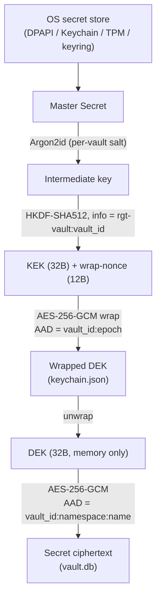
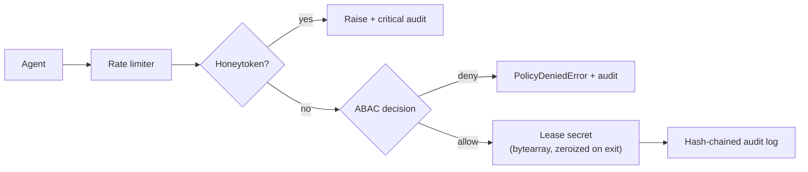

# Hardened Agent Vault Cryptographic Architecture

The **Agent Vault** implements a defense-in-depth cryptographic architecture using a multi-stage key hierarchy informed by **NIST SP 800-57** key-management guidance. This keeps secrets confidential against offline attacks on the database and enables fast administrative key rotation. (See [SECURITY.md](SECURITY.md) for the precise guarantees and non-goals — including where these protections stop.)

## Diagrams

### Key hierarchy (data at rest)



### Access path (per request)




> ## ⚠️ NOT WIRED — "rgtp-protocol" two-signal pattern
>
> The original architecture brief and `docs/audits/2026-06-17-clarity-of-vision.md`
> §F-1 (RGT-130) describe a two-signal access pattern that would have rgt-vault
> runtime calls be mediated by an `rgtp-protocol.Proxy` component. **That
> component does not exist in the current codebase** — no `rgtp-protocol/`
> directory, no `rgtp` imports, and no runtime path through it. All current
> access flows go directly through `VaultManager.lease_secret()` as shown
> in the access-path diagram above.
>
> Status: **deferred** (RGT-130, option c). The concept is preserved here for
> historical reference; the v0.3.0 Go rewrite (RGT-128, RGT-166) is the
> place where any new mediation surface should land, not a Python-side
> retrofit. The Python v0.2.x line is in maintenance mode (RGT-164) and
> will not gain a new rgtp module.

## 1. Cryptographic Primitives
The vault leverages industry-standard, authenticated encryption and robust key derivation functions:
- **AES-256-GCM**: Primary encryption for all secrets at rest. Provides Authenticated Encryption with Associated Data (AEAD).
- **Argon2id**: Memory-hard password stretching algorithm to derive keys resistant to GPU/ASIC cracking.
- **HKDF-SHA512**: HMAC-based Extract-and-Expand Key Derivation Function used to bind derived keys to specific contextual domains.
- **csprng**: `os.urandom` provides cryptographically secure random numbers for all salts, nonces, and DEKs.

## 2. Key Hierarchy
The vault uses a **Master Secret / Key Encryption Key (KEK) / Data Encryption Key (DEK)** architecture. This avoids encrypting raw data directly with the master password.

### Master Secret
- **Purpose**: The root of trust. Serves as the high-entropy input to the derivation tree.
- **Location**: Stored securely in the operating system's native keychain (e.g., Windows Credential Manager, macOS Keychain) via `KeyringProvider`.
- **Destruction**: Must be explicitly deleted from the OS keychain.
- **Rotation Frequency**: Dependent on organizational policy (e.g., every 90 days or upon suspected OS compromise). Fast rotation requires no data re-encryption.

### Argon2id Intermediate
- **Purpose**: Defends the root of trust against brute force. Stretches the Master Secret using a unique salt.
- **Storage**: Never persisted. Exists only in ephemeral memory during key derivation.
- **Parameters**: High memory cost (default 256MB), minimal time cost (4 iterations), and multi-lane parallelism (4) to optimize for rapid legitimate access while heavily penalizing parallel attackers.

### Key Encryption Key (KEK) & Nonce
- **Purpose**: Authenticated wrapping of the Data Encryption Key (DEK).
- **Derivation**: `HKDF-SHA512` extracts a 64-byte sequence from the Argon2id intermediate. The first 32 bytes act as the KEK, and the remaining 32 bytes are expanded into a 12-byte AES-GCM nonce.
- **Binding Context**: The HKDF info parameter includes `rgt-vault:<vault_id>`, explicitly binding the KEK to the exact SQLite database instance.
- **Storage**: Never persisted.
- **Rotation Frequency**: Rotated automatically whenever the Master Secret is rotated.

### Wrapped DEK (keychain.json)
- **Purpose**: Safely stores the encrypted Data Encryption Key on disk next to the SQLite database.
- **Location**: `~/.secure-vault/keychain.json`
- **Integrity**: Wrapped using `AES-256-GCM` with Associated Data (AAD) containing `vault_id:key_epoch`. This guarantees that an attacker cannot copy a `keychain.json` from an older backup (rollback attack) or another vault.
- **Recovery Method**: Handled transparently by `HardenedDEKManager` during startup.

### Data Encryption Key (DEK)
- **Purpose**: The actual 32-byte AES-256 key used to encrypt and decrypt individual secrets in the database.
- **Location**: Exists only in ephemeral memory.
- **Destruction**: Swept by Python's GC upon shutdown, though intermediate decrypted chunks are aggressively zeroized using `ctypes.memset`.
- **Rotation Frequency**: Slow rotation requiring bulk data re-encryption. Recommended annually or upon suspected active memory compromise.

## 3. Storage and Associated Data (AAD) Binding
Each individual secret within the `secrets` table is encrypted natively with AES-256-GCM. 
A unique 96-bit (12-byte) nonce is generated for every secret.
To prevent ciphertext swapping (where an attacker overwrites a high-privilege secret's ciphertext with a low-privilege secret's ciphertext), the encryption utilizes strict **Associated Authenticated Data (AAD)**:

```text
AAD = "<vault_id>:<namespace>:<secret_name>"
```

If an attacker modifies the `namespace` or `name` in the database, or attempts to swap ciphertexts, the AES-GCM tag verification will fail, raising an `InvalidTag` exception and triggering an audit failure log.

## 4. Rollback Protection (partial)
The vault tracks a monotonically increasing `key_epoch` to detect *mismatched*
key material.
- The `metadata` table in SQLite stores the current `key_epoch`.
- `keychain.json` records the epoch its wrapped DEK was created under, and the
  epoch is bound into the KEK-wrap AAD (`vault_id:epoch`).
- During startup, if the SQLite `key_epoch` does not match the `keychain.json`
  epoch, the system **fails closed**.

**Limitation (be explicit):** this only detects mixing a *current* database
with a *stale* keychain (or vice versa). It does **not** detect restoring a
*matched* old pair — an attacker who restores both an old `vault.db` and the
old `keychain.json` from the same backup passes the check, because their epochs
agree, and regains access with the old (possibly compromised) master key. The
epoch lives in the rollback-able database, so it cannot anchor against a
full-backup rollback. Genuine rollback resistance requires anchoring the epoch
in an append-only or hardware-monotonic store outside the database (roadmap).
See `SECURITY.md` for the stated guarantee.

## 5. Defense-in-Depth Features
- **Zeroization**: The `lease_secret` and `execute` functions yield secrets into mutable `bytearray` buffers, which are deterministically wiped using memory-unsafe zeroization upon completion.
- **Cryptographic Self-Test**: Upon initialization, the vault runs a mandatory `run_crypto_selftest()` to verify the integrity and correct operation of Argon2id, HKDF, and AES-GCM primitives.
- **Hash-Chained Audits**: All cryptographic operations (successes, failures, rotations) are securely logged using an immutable hash-chained audit table.
