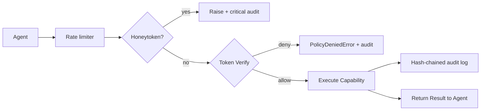

# Execution Flow

The capability execution flow ensures that agents never interact with raw secrets. Instead, they present a capability token, and the Vault executes the requested action on their behalf.

## Access Path

## Request Lifecycle

1. **Freeze Check:** Validates the system is not in a panic/frozen state.
2. **Token Verification:** Validates the HMAC/Ed25519 signature of the capability token.
3. **Context Binding:** Ensures the parameters match the restricted token bindings.
4. **Hook Consultation:** Fires synchronous webhooks for external SOAR/ABAC decisions.
5. **Execution:** The registered capability handler runs, using the secret internally.
6. **Zeroization:** Secret material is aggressively purged from memory upon completion.
7. **Audit:** An immutable, hash-chained log is written for the execution.
